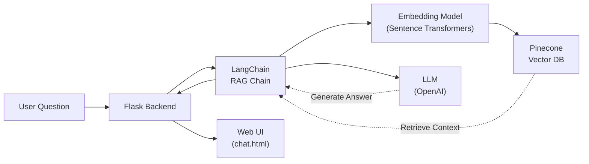

<div align="center">

# Medical Chatbot with LLMs

**An AI-powered medical assistant that provides accurate health information using Retrieval-Augmented Generation (RAG).**

Ask health-related questions and get context-aware answers grounded in a comprehensive medical knowledge base.

[](https://flask.palletsprojects.com/)
[](https://www.python.org/)
[](https://langchain.com/)
[](https://www.pinecone.io/)

</div>

---

## Features

| Feature | Description |
| **Web Interface** | Clean, intuitive chat interface built with Flask, HTML, and CSS. |

---

## Architecture



---

## Tech Stack

- **Backend Framework**: [Flask](https://flask.palletsprojects.com/)
- **Frontend**: HTML5, CSS3 (`chat.html`, `style.css`)
- **AI Framework**: [LangChain](https://langchain.com/)
- **Vector Database**: [Pinecone](https://www.pinecone.io/)
- **Embeddings**: [Sentence-Transformers](https://sbert.net/) (`sentence-transformers`)
- **LLM Provider**: [OpenAI](https://openai.com/)
- **Document Processing**: `pypdf` for PDF parsing

---

## Quick Start

### Prerequisites

- Python ≥ 3.10
- Pinecone API Key and Environment
- OpenAI API Key

### Installation

```bash
# Clone the repository
git clone https://github.com/MaddipatlaChetan24/Medical-Chatbot-with-LLMs.git
cd Medical-Chatbot-with-LLMs

# Create and activate virtual environment
python -m venv .venv
source .venv/bin/activate   # macOS/Linux
# .venv\Scripts\activate    # Windows

# Install dependencies
pip install -r requirements.txt
```

### Configuration

Create a `.env` file in the root directory:

```env
PINECONE_API_KEY=your_pinecone_api_key
PINECONE_ENV=your_pinecone_environment
OPENAI_API_KEY=your_openai_api_key
```

### Data Ingestion

Before running the app, index the medical knowledge base into Pinecone:

```bash
# Ensure your data/Medical_book.pdf is present
python store_index.py
```

### Run the App

```bash
python app.py
```

The application will be available at **http://127.0.0.1:8080/** (or your Flask default port).

---

## Project Structure

```text
Medical-Chatbot-with-LLMs/
├── app.py                # Flask entry point & API routes
├── store_index.py        # Script to process PDF and populate Pinecone vector DB
├── requirements.txt      # Python dependencies
├── .env                  # Environment variables
├── setup.py              # Package setup
├── src/                  # Core source code
│   ├── helper.py         # Utility functions (PDF loading, text splitting, embeddings)
│   └── prompt.py         # LLM prompt templates
├── data/                 # Source data
│   └── Medical_book.pdf  # Knowledge base document
├── static/               # Static assets
│   └── style.css         # Chat interface styles
└── template/             # HTML templates
    └── chat.html         # Main web interface
```

---

## Usage

1. Start the Flask application by running `python app.py`.
2. Open `http://127.0.0.1:8080/` in your browser.
3. Type a health-related query in the chat interface.
4. The system retrieves relevant medical context from the indexed PDF and generates a grounded response.

---

## Environment Variables

| Variable | Required | Description |
|---|---|---|
| `OPENAI_API_KEY` | Yes | OpenAI API key for LLM inference |
| `PINECONE_API_KEY` | Yes | Pinecone API key for vector database access |
| `PINECONE_ENV` | Yes | Pinecone environment (e.g., `gcp-starter`) |

---

## License

This project is open-source and available for educational purposes.

---

<div align="center">
<sub>Built using Python, Flask, LangChain, Pinecone & OpenAI</sub>
</div>
